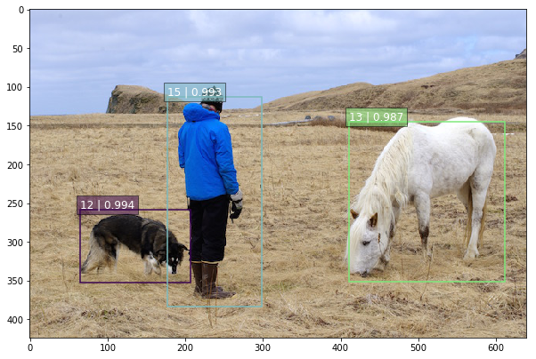
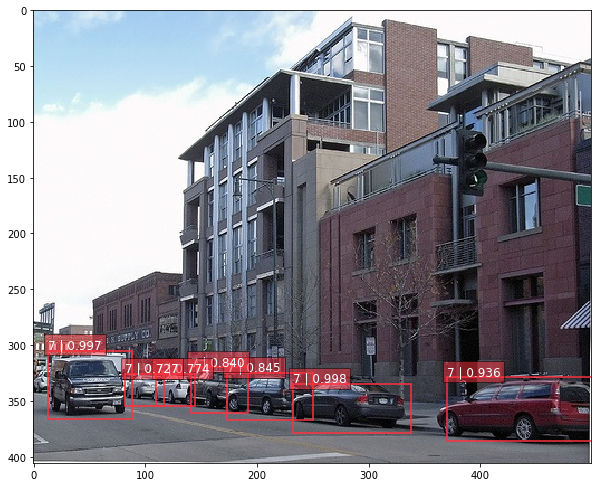

# SSD: Single Shot MultiBox Detector in TensorFlow

SSD is an unified framework for object detection with a single network. It has been originally introduced in this research [article](http://arxiv.org/abs/1512.02325).

This repository contains a TensorFlow re-implementation of the original [Caffe code](https://github.com/weiliu89/caffe/tree/ssd). At present, it only implements VGG-based SSD networks (with 300 and 512 inputs), but the architecture of the project is modular, and should make easy the implementation and training of other SSD variants (ResNet or Inception based for instance). Present TF checkpoints have been directly converted from SSD Caffe models.

The organisation is inspired by the TF-Slim models repository containing the implementation of popular architectures (ResNet, Inception and VGG). Hence, it is separated in three main parts:
* datasets: interface to popular datasets (Pascal VOC, COCO, ...) and scripts to convert the former to TF-Records;
* networks: definition of SSD networks, and common encoding and decoding methods (we refer to the paper on this precise topic);
* pre-processing: pre-processing and data augmentation routines, inspired by original VGG and Inception implementations.

## SSD minimal example

The [SSD Notebook](notebooks/ssd_notebook.ipynb) contains a minimal example of the SSD TensorFlow pipeline. Shortly, the detection is made of two main steps: running the SSD network on the image and post-processing the output using common algorithms (top-k filtering and Non-Maximum Suppression algorithm).

Here are two examples of successful detection outputs:



To run the notebook you first have to unzip the checkpoint files in ./checkpoint
```bash
unzip ssd_300_vgg.ckpt.zip
```
and then start a jupyter notebook with
```bash
jupyter notebook notebooks/ssd_notebook.ipynb
```


## Datasets

The current version only supports Pascal VOC datasets (2007 and 2012). In order to be used for training a SSD model, the former need to be converted to TF-Records using the `tf_convert_data.py` script:
```bash
DATASET_DIR=./VOC2007/test/
OUTPUT_DIR=./tfrecords
python tf_convert_data.py \
    --dataset_name=pascalvoc \
    --dataset_dir=${DATASET_DIR} \
    --output_name=voc_2007_train \
    --output_dir=${OUTPUT_DIR}
```
Note the previous command generated a collection of TF-Records instead of a single file in order to ease shuffling during training.

## Evaluation on Pascal VOC 2007

The present TensorFlow implementation of SSD models have the following performances:

| Model | Training data  | Testing data | mAP | FPS  |
|--------|:---------:|:------:|:------:|:------:|
| [SSD-300 VGG-based](https://drive.google.com/file/d/0B0qPCUZ-3YwWUXh4UHJrd1RDM3c/view?usp=sharing) | VOC07+12+COCO trainval | VOC07 test | 0.773 | - |
| [SSD-512 VGG-based](https://drive.google.com/open?id=0B0qPCUZ-3YwWT1RCLVZNN3RTVEU) | VOC07+12+COCO trainval | VOC07 test | 0.818 | - |

We are working hard at reproducing the same performance as the original [Caffe implementation](https://github.com/weiliu89/caffe/tree/ssd)!

After downloading and extracting the previous checkpoints, the evaluation metrics should be reproducible by running the following command:
```bash
EVAL_DIR=./logs/
CHECKPOINT_PATH=./checkpoints/VGG_VOC0712_SSD_300x300_ft_iter_120000.ckpt
python eval_ssd_network.py \
    --eval_dir=${EVAL_DIR} \
    --dataset_dir=${DATASET_DIR} \
    --dataset_name=pascalvoc_2007 \
    --dataset_split_name=test \
    --model_name=ssd_300_vgg \
    --checkpoint_path=${CHECKPOINT_PATH} \
    --batch_size=1
```
The evaluation script provides estimates on the recall-precision curve and compute the mAP metrics following the Pascal VOC 2007 and 2012 guidelines.

In addition, if one wants to experiment/test a different Caffe SSD checkpoint, the former can be converted to TensorFlow checkpoints as following:
```sh
CAFFE_MODEL=./ckpts/SSD_300x300_ft_VOC0712/VGG_VOC0712_SSD_300x300_ft_iter_120000.caffemodel
python caffe_to_tensorflow.py \
    --model_name=ssd_300_vgg \
    --num_classes=21 \
    --caffemodel_path=${CAFFE_MODEL}
```

## Training

The script `train_ssd_network.py` is in charged of training the network. Similarly to TF-Slim models, one can pass numerous options to the training process (dataset, optimiser, hyper-parameters, model, ...). In particular, it is possible to provide a checkpoint file which can be use as starting point in order to fine-tune a network.
```bash
DATASET_DIR=./tfrecords
TRAIN_DIR=./logs/
CHECKPOINT_PATH=./checkpoints/ssd_300_vgg.ckpt
python train_ssd_network.py \
    --train_dir=${TRAIN_DIR} \
    --dataset_dir=${DATASET_DIR} \
    --dataset_name=pascalvoc_2007 \
    --dataset_split_name=train \
    --model_name=ssd_300_vgg \
    --checkpoint_path=${CHECKPOINT_PATH} \
    --save_summaries_secs=60 \
    --save_interval_secs=600 \
    --weight_decay=0.00001 \
    --optimizer=rmsprop \
    --learning_rate=0.0001 \
    --batch_size=32
```
One can also specify the scopes of variables to load or ignore from a checkpoint. It is particularly useful to fine-tune a model using weights from the original base network (VGG, ResNets, Inception, ...).

In addition to the script flags, one may also want to experiment with data augmentation (random cropping, resolution, ...) or/and network parameters (feature layers, anchors boxes, ...).

The training script can be combined with the previous evaluation one in order to monitor the performance of saved checkpoints on a validation dataset. For that purpose, one can pass to training and validation scripts a GPU memory upper limit such that both can run in parallel on the same device.
